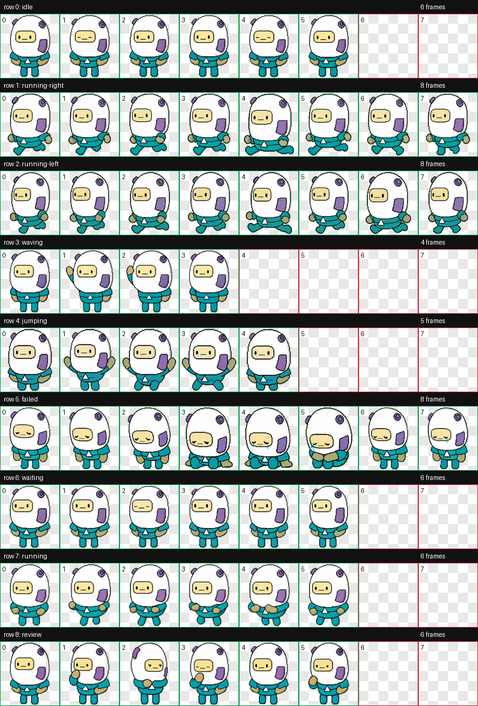

# Superweirdo Codex Pet

`Superweirdo` is a custom Codex pet based on a character from our new game **SuperWEIRD**.



## Included Files

- `pet.json`
- `spritesheet.webp`
- `preview.png`

## Install

1. Download this repository as a ZIP, or clone it.
2. Create the folder `~/.codex/pets/superweirdo/`
3. Copy `pet.json` and `spritesheet.webp` into that folder.
4. Restart Codex if it is already open.

Final structure:

```text
~/.codex/pets/superweirdo/
├── pet.json
└── spritesheet.webp
```

## About SuperWEIRD

Superweirdo is a character from our new game **SuperWEIRD**.

- Game site: [superweird.io](https://superweird.io)
- Studio site: [luden.io](https://luden.io)
- Wishlist on Steam: [SuperWEIRD: Automation Roguelite](https://store.steampowered.com/app/3818770/SuperWEIRD_Automation_Roguelite/?utm_source=githubsuperweirdocodexpet)
- Join our Discord and get a free Steam playtest key: [discord.gg/wYtNbGVmxU](https://discord.gg/wYtNbGVmxU)
